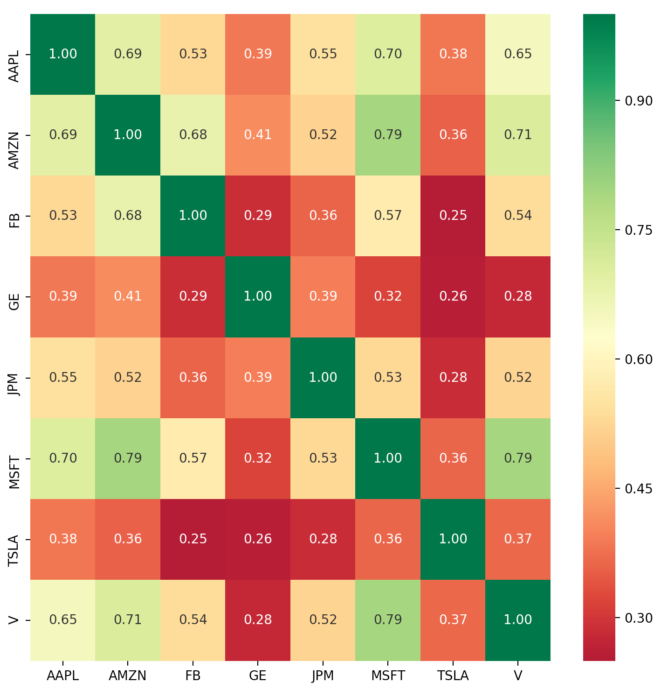

# stock-analysis
Python script that imports historical data of various stocks, generates statistical measures of stock return data (ex. volatility, skew, kurtosis), plots a correlation heat map of the stocks' returns, and stores the statistical stock data in a SQL database.

Instructions:
1. Go to the working directory where you want all relevant stock analysis files to be located. This will be the same directory where the database will be created in.
2. Download stock-analysis.py all all stock .csv files in the desired working directory
3. Run Python script using the command: python stock-analysis.py

Results:

Text output of correlation matrix (heat map)
###

Text output of database table "stocks"
###

Correlation heat map

